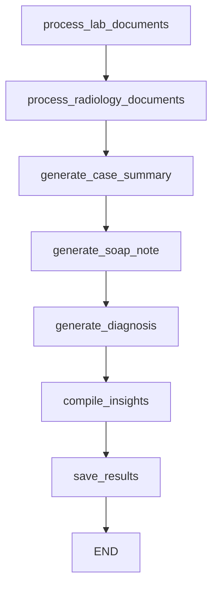

## Overview

The **Medical Insights Agent** is the primary text analysis component of MedMitra's AI system. It processes structured and unstructured medical data to generate comprehensive clinical assessments, including case summaries, SOAP notes, and diagnostic insights.

## Architecture

The agent is implemented in `backend/agents/medical_ai_agent.py` and uses a LangGraph workflow to orchestrate multiple analysis steps.

### Class Structure

```python backend/agents/medical_ai_agent.py
class MedicalInsightsAgent(BaseAgent):
    
    def __init__(self, model_name: str = "llama-3.3-70b-versatile", temperature: float = 0.2):
        self.llm_manager = LLMManager(model_name=model_name, temperature=temperature)
        self.supabase = SupabaseCaseClient()
        self.workflow = self.build_workflow()
```

### Key Components

- **LLM Manager**: Handles interactions with the Groq API using Llama 3.3 70B
- **Supabase Client**: Manages database operations for saving insights
- **Workflow**: LangGraph state machine that defines the analysis pipeline

## Workflow Graph

The agent constructs a directed graph with the following nodes:

```python backend/agents/medical_ai_agent.py
def build_workflow(self) -> StateGraph:
    builder = StateGraph(MedicalAnalysisState)

    # Add processing nodes
    builder.add_node("process_lab_documents", self._process_lab_documents)
    builder.add_node("process_radiology_documents", self._process_radiology_documents)
    builder.add_node("generate_case_summary", self._generate_case_summary)
    builder.add_node("generate_soap_note", self._generate_soap_note)
    builder.add_node("generate_diagnosis", self._generate_diagnosis)
    builder.add_node("compile_insights", self._compile_insights)
    builder.add_node("save_results", self._save_results)
    
    # Define execution order
    builder.set_entry_point("process_lab_documents")
    builder.add_edge("process_lab_documents", "process_radiology_documents")
    builder.add_edge("process_radiology_documents", "generate_case_summary")
    builder.add_edge("generate_case_summary", "generate_soap_note")
    builder.add_edge("generate_soap_note", "generate_diagnosis")
    builder.add_edge("generate_diagnosis", "compile_insights")
    builder.add_edge("compile_insights", "save_results")
    builder.add_edge("save_results", END)
    
    return builder.compile()
```

### Workflow Visualization



## Processing Nodes

### 1. Process Lab Documents

Extracts structured data from laboratory reports:

```python backend/agents/medical_ai_agent.py:71-92
async def _process_lab_documents(self, state: MedicalAnalysisState) -> MedicalAnalysisState:
    logger.info("Processing laboratory documents...")
    processed_docs = []
    
    for lab_file in state["case_input"].lab_files:
        if lab_file.text_data:
            lab_analysis = await self.llm_manager.generate_response(
                system_prompt=LAB_ANALYSIS_PROMPT, 
                user_input=lab_file.text_data
            )
            
            lab_doc = LabDocument(
                file_id=lab_file.file_id,
                file_name=lab_file.file_name,
                extracted_text=lab_file.text_data,
                lab_values=lab_analysis.get("lab_values"),
                summary=lab_analysis.get("summary")
            )
            processed_docs.append(lab_doc)
    
    state["processed_lab_docs"] = processed_docs
    state["processing_stage"] = "lab_documents_processed"
    return state
```

**Output**: Structured `LabDocument` objects with extracted values and summaries.

### 2. Process Radiology Documents

Integrates radiology findings from the Vision Agent:

```python backend/agents/medical_ai_agent.py:94-119
async def _process_radiology_documents(self, state: MedicalAnalysisState) -> MedicalAnalysisState:
    logger.info("Processing radiology documents...")
    processed_docs = []
    
    for radiology_file in state["case_input"].radiology_files:
        if radiology_file.ai_summary:
            try:
                import json
                ai_summary_data = json.loads(radiology_file.ai_summary)
                summary_text = ai_summary_data.get("summary", radiology_file.ai_summary)
            except (json.JSONDecodeError, TypeError):
                summary_text = radiology_file.ai_summary
            
            radiology_doc = RadiologyDocument(
                file_id=radiology_file.file_id,
                file_name=radiology_file.file_name,
                summary=summary_text,
            )
            processed_docs.append(radiology_doc)
    
    state["processed_radiology_docs"] = processed_docs
    state["processing_stage"] = "radiology_documents_processed"
    return state
```

**Output**: `RadiologyDocument` objects with AI-generated summaries.

### 3. Generate Case Summary

Synthesizes all available information into a comprehensive case overview:

```python backend/agents/medical_ai_agent.py:121-162
async def _generate_case_summary(self, state: MedicalAnalysisState) -> MedicalAnalysisState:
    logger.info("Generating case summary...")
    
    patient_data = state["case_input"].patient_data
    patient_info_str = f"Name: {patient_data.name}, Age: {patient_data.age}, Gender: {patient_data.gender}"
    
    case_context = {
        "patient_info": patient_info_str,
        "doctor_notes": state["case_input"].doctor_case_summary or "None provided",
        "lab_summaries": "; ".join([doc.summary for doc in state["processed_lab_docs"] if doc.summary]),
        "radiology_summaries": "; ".join([doc.summary for doc in state["processed_radiology_docs"] if doc.summary])
    }
    
    summary_response = await self.llm_manager.generate_response(
        system_prompt=CASE_SUMMARY_PROMPT, 
        user_input='',
        prompt_variables=case_context
    )
    
    case_summary = CaseSummary(
        comprehensive_summary=summary_response.get("summary"),
        key_findings=summary_response.get("key_findings", []),
        patient_context=state["case_input"].patient_data,
        doctor_notes=state["case_input"].doctor_case_summary,
        lab_summary="; ".join([doc.summary for doc in state["processed_lab_docs"] if doc.summary]),
        radiology_summary="; ".join([doc.summary for doc in state["processed_radiology_docs"] if doc.summary]),
        confidence_score=summary_response.get("confidence_score", 0.8)
    )
    
    state["case_summary"] = case_summary
    state["processing_stage"] = "case_summary_generated"
    return state
```

**Output**: `CaseSummary` with comprehensive overview and key findings.

### 4. Generate SOAP Note

Creates a structured clinical note following the SOAP format:

```python backend/agents/medical_ai_agent.py:164-184
async def _generate_soap_note(self, state: MedicalAnalysisState) -> MedicalAnalysisState:
    logger.info("Generating SOAP note...")

    soap_response = await self.llm_manager.generate_response(
        system_prompt=SOAP_NOTE_PROMPT, 
        user_input="Case Summary" + state["case_summary"].model_dump_json()
    )
    
    soap_note = SOAPNote(
        subjective=soap_response.get("subjective", ""),
        objective=soap_response.get("objective", ""),
        assessment=soap_response.get("assessment", ""),
        plan=soap_response.get("plan", ""),
        confidence_score=soap_response.get("confidence_score", 0.8)
    )
    
    state["soap_note"] = soap_note
    state["processing_stage"] = "soap_note_generated"
    return state
```

**SOAP Components**:
- **S**ubjective: Patient's reported symptoms and history
- **O**bjective: Observable findings from tests and examinations
- **A**ssessment: Clinical analysis and interpretation
- **P**lan: Recommended next steps and treatments

### 5. Generate Diagnosis

Produces a primary diagnosis with ICD coding and supporting evidence:

```python backend/agents/medical_ai_agent.py:186-207
async def _generate_diagnosis(self, state: MedicalAnalysisState) -> MedicalAnalysisState:
    logger.info("Generating primary diagnosis...")
    
    diagnosis_response = await self.llm_manager.generate_response(
        system_prompt=DIAGNOSIS_PROMPT, 
        user_input="SOAP Note: " + state["soap_note"].model_dump_json()
    )
    
    diagnosis = Diagnosis(
        primary_diagnosis=diagnosis_response.get("diagnosis", ""),
        icd_code=diagnosis_response.get("icd_code"),
        description=diagnosis_response.get("description", ""),
        confidence_score=diagnosis_response.get("confidence_score", 0.8),
        supporting_evidence=diagnosis_response.get("supporting_evidence", [])
    )
    
    state["primary_diagnosis"] = diagnosis
    state["processing_stage"] = "diagnosis_generated"
    return state
```

**Output**: `Diagnosis` with ICD-10 code and clinical reasoning.

### 6. Compile Insights

Aggregates all analysis results into a unified output:

```python backend/agents/medical_ai_agent.py:260-286
async def _compile_insights(self, state: MedicalAnalysisState) -> MedicalAnalysisState:
    logger.info("Compiling medical insights...")
    
    # Calculate overall confidence score
    confidence_scores = [
        state["case_summary"].confidence_score,
        state["soap_note"].confidence_score,
        state["primary_diagnosis"].confidence_score
    ]
    overall_confidence = sum(confidence_scores) / len(confidence_scores)
    
    medical_insights = MedicalInsights(
        case_summary=state["case_summary"],
        soap_note=state["soap_note"],
        primary_diagnosis=state["primary_diagnosis"],
        overall_confidence_score=overall_confidence
    )
    
    state["medical_insights"] = medical_insights
    state["processing_stage"] = "insights_compiled"
    return state
```

### 7. Save Results

Persists the final insights to Supabase:

```python backend/agents/medical_ai_agent.py:288-310
async def _save_results(self, state: MedicalAnalysisState) -> MedicalAnalysisState:
    logger.info("Saving results to database...")
    
    try:
        insights_data = state["medical_insights"].model_dump()

        await self.supabase.upload_ai_insights(
            case_id=state["case_input"].case_id,
            insights=insights_data
        )
        
        state["processing_stage"] = "completed"
        logger.info(f"Successfully saved medical insights for case {state['case_input'].case_id}")
        
    except Exception as e:
        logger.error(f"Error saving results: {e}")
        state["processing_errors"].append(f"Error saving results: {str(e)}")
        state["processing_stage"] = "error"
    
    return state
```

## Usage Example

Processing a case through the Medical Insights Agent:

```python
from agents.medical_ai_agent import MedicalInsightsAgent
from models.data_models import CaseInput, PatientData, ProcessedFile

# Initialize agent
medical_agent = MedicalInsightsAgent()

# Prepare case input
case_input = CaseInput(
    case_id="case-123",
    patient_data=PatientData(
        name="John Doe",
        age=45,
        gender="Male"
    ),
    doctor_case_summary="Patient presents with chest pain",
    lab_files=processed_lab_files,
    radiology_files=processed_radiology_files
)

# Process case
medical_insights = await medical_agent.process(case_input)

print(f"Diagnosis: {medical_insights.primary_diagnosis.primary_diagnosis}")
print(f"Confidence: {medical_insights.overall_confidence_score}")
```

## Model Configuration

### Default Settings

```python
model_name = "llama-3.3-70b-versatile"  # Groq's Llama 3.3 70B
temperature = 0.2  # Low temperature for consistent medical analysis
```

### Why Llama 3.3 70B?

- **Large context window**: Handles lengthy medical documents
- **Medical knowledge**: Strong understanding of clinical terminology
- **Structured output**: Reliable JSON generation for data extraction
- **Cost-effective**: Via Groq's optimized inference

## Confidence Scoring

Each analysis step generates a confidence score that reflects:

- **Data completeness**: How much relevant information was available
- **Model certainty**: LLM's confidence in its analysis
- **Consistency**: Agreement between different data sources

The overall confidence score is the average of all component scores:

```python
overall_confidence = sum([
    case_summary.confidence_score,
    soap_note.confidence_score,
    primary_diagnosis.confidence_score
]) / 3
```

## Error Handling

The agent tracks errors in the state and continues processing when possible:

```python
state["processing_errors"].append(f"Error saving results: {str(e)}")
state["processing_stage"] = "error"
```

Case status is updated in the database to reflect failures:

```python backend/agentic.py
try:
    medical_insights = await medical_agent.process(case_input)
    await supabase.update_case_status(case_id=case_id, status="completed")
except Exception as e:
    logger.error(f"Error in AI insights generation: {e}")
    await supabase.update_case_status(case_id=case_id, status="failed")
```

## Future Enhancements

The codebase includes commented sections for planned features:

- **Differential Diagnoses**: Multiple possible diagnoses with probabilities
- **Investigation Recommendations**: Suggested tests and imaging studies
- **Treatment Recommendations**: Evidence-based treatment plans

These will be activated in future releases:

```python backend/agents/medical_ai_agent.py:41-42
# builder.add_node("generate_differential_diagnosis", self._generate_differential_diagnosis)
# builder.add_node("generate_recommendations", self._generate_recommendations)
```

## Next Steps

<CardGroup cols={2}>
  <Card title="Vision Agent" icon="eye" href="/ai-agents/vision-agent">
    Learn about medical image analysis
  </Card>
  <Card title="Complete Workflow" icon="diagram-project" href="/ai-agents/workflow">
    See the full processing pipeline
  </Card>
</CardGroup>