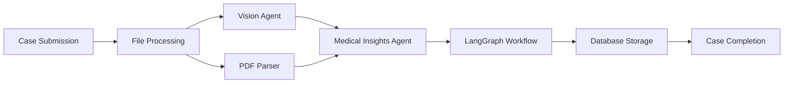

## Introduction

MedMitra's AI system employs a **multi-agent architecture** powered by LangGraph to process complex medical cases. The system orchestrates specialized agents that work together to analyze patient data, extract insights from medical documents, and generate comprehensive clinical assessments.

## Architecture Overview

The AI system consists of two primary specialized agents:

<CardGroup cols={2}>
  <Card title="Medical Insights Agent" icon="stethoscope" href="/ai-agents/medical-insights-agent">
    Analyzes lab reports, generates SOAP notes, and provides diagnostic insights
  </Card>
  <Card title="Vision Agent" icon="eye" href="/ai-agents/vision-agent">
    Processes radiology images using vision models to extract medical findings
  </Card>
</CardGroup>

## System Components

### 1. Agent Orchestration Layer

The `agentic_process` function in `backend/agentic.py` serves as the main orchestrator:

```python backend/agentic.py
async def agentic_process(
    case_id: str, 
    user_id: str,
    patient_name: str,
    patient_age: int,
    patient_gender: str,
    case_summary: Optional[str] = None,
    lab_files: Optional[List[Dict[str, Any]]] = None,
    radiology_files: Optional[List[Dict[str, Any]]] = None
):
```

### 2. State Management

The system uses **TypedDict state models** to track processing through the pipeline. The primary state container is `MedicalAnalysisState`:

```python backend/models/state_models.py
class MedicalAnalysisState(TypedDict):
    # Input data
    case_input: CaseInput
    
    # Processed documents
    processed_lab_docs: List[LabDocument]
    processed_radiology_docs: List[RadiologyDocument]
    
    # Analysis results
    case_summary: Optional[CaseSummary]
    soap_note: Optional[SOAPNote]
    primary_diagnosis: Optional[Diagnosis]
    
    # Final output
    medical_insights: Optional[MedicalInsights]
    
    # Processing metadata
    processing_errors: List[str]
    processing_stage: str
    confidence_scores: Dict[str, float]
```

### 3. Data Flow



## Processing Pipeline

The complete case analysis follows this sequence:

<Steps>
  <Step title="File Upload & Categorization">
    Files are uploaded and categorized as either `lab` or `radiology` documents
  </Step>
  
  <Step title="Document Processing">
    - **Lab files**: Extracted using PDF parser to text
    - **Radiology files**: Analyzed by Vision Agent for visual findings
  </Step>
  
  <Step title="Medical Analysis Workflow">
    The Medical Insights Agent processes documents through a LangGraph workflow:
    - Process lab documents
    - Process radiology documents
    - Generate case summary
    - Generate SOAP note
    - Generate primary diagnosis
    - Compile insights
  </Step>
  
  <Step title="Result Storage">
    Final insights are saved to Supabase with confidence scores
  </Step>
</Steps>

## Key Features

### Parallel Processing

The system can process multiple documents concurrently:

```python backend/agentic.py
if lab_files:
    for lab_file in lab_files:
        # Process each lab file
        result = await process_pdf_async(temp_file_path)
        
if radiology_files:
    # Process all radiology files for the case
    result = await vision_agent(case_id)
```

### Confidence Scoring

Every analysis step generates a confidence score (0.0-1.0) that reflects the model's certainty:

```python backend/agents/medical_ai_agent.py
confidence_scores = [
    state["case_summary"].confidence_score,
    state["soap_note"].confidence_score,
    state["primary_diagnosis"].confidence_score
]
overall_confidence = sum(confidence_scores) / len(confidence_scores)
```

### Error Handling

The system tracks errors throughout the pipeline and updates case status accordingly:

```python
try:
    medical_insights = await medical_agent.process(case_input)
    await supabase.update_case_status(case_id=case_id, status="completed")
except Exception as e:
    logger.error(f"Error in AI insights generation: {e}")
    await supabase.update_case_status(case_id=case_id, status="failed")
```

## LangGraph Integration

MedMitra uses **LangGraph** to define the workflow as a directed graph. This provides:

- **Stateful processing**: Each node updates the shared state
- **Clear dependencies**: Edges define the execution order
- **Parallel execution**: Independent nodes can run concurrently
- **Error recovery**: Failed nodes can be retried or alternative paths taken

See the [Workflow documentation](/ai-agents/workflow) for detailed graph structure.

## Models Used

| Agent | Model | Purpose |
|-------|-------|----------|
| Medical Insights Agent | `llama-3.3-70b-versatile` | Text analysis, diagnosis generation |
| Vision Agent | `meta-llama/llama-4-scout-17b-16e-instruct` | Medical image analysis |

## Next Steps

<CardGroup cols={2}>
  <Card title="Medical Insights Agent" icon="stethoscope" href="/ai-agents/medical-insights-agent">
    Deep dive into the text analysis agent
  </Card>
  <Card title="Vision Agent" icon="eye" href="/ai-agents/vision-agent">
    Learn about medical image processing
  </Card>
  <Card title="Workflow Details" icon="diagram-project" href="/ai-agents/workflow">
    Understand the complete processing pipeline
  </Card>
  <Card title="API Reference" icon="code" href="/api-reference/endpoints/create-case">
    Integrate with the case creation API
  </Card>
</CardGroup>