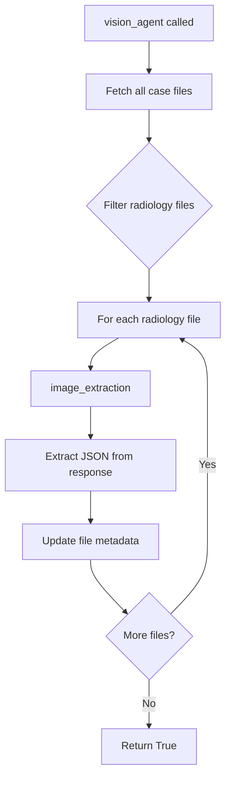
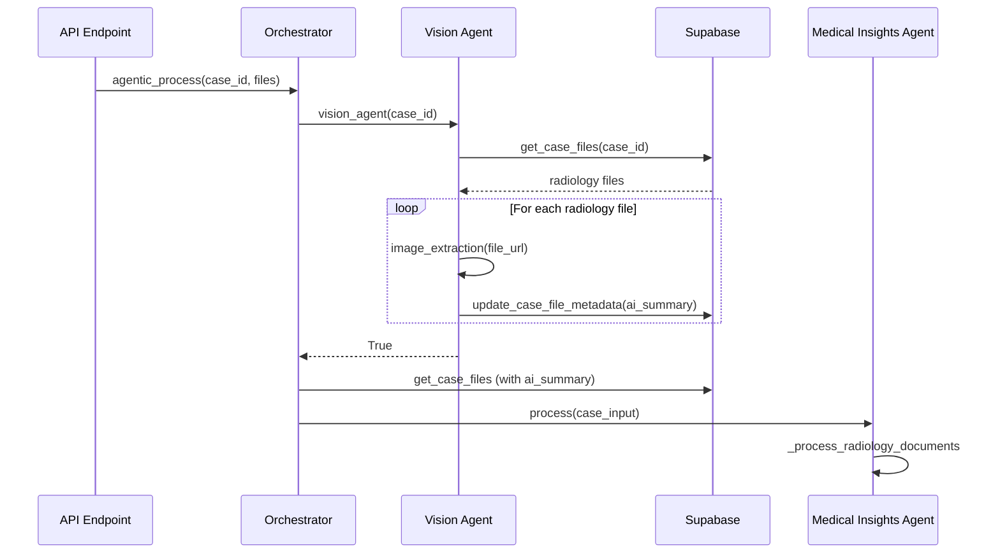

## Overview

The **Vision Agent** is MedMitra's specialized component for analyzing medical images, particularly radiology scans such as X-rays, CT scans, and MRIs. It uses multimodal vision-language models to extract clinical findings directly from images.

## Architecture

The Vision Agent is implemented in `backend/agents/vision_agent.py` and uses Groq's Llama Vision model for image analysis.

### Key Functions

```python backend/agents/vision_agent.py
async def image_extraction(image_url: str):
    """Vision agent for a single image."""
    
async def vision_agent(case_id: str):
    """Vision agent for all radiology images in a case."""
```

## Image Analysis Process

### Single Image Extraction

The `image_extraction` function processes individual radiology images:

```python backend/agents/vision_agent.py:19-54
async def image_extraction(image_url: str):
    logger.info(f"Starting vision agent for image ------ {image_url}")

    completion = client.chat.completions.create(
        model="meta-llama/llama-4-scout-17b-16e-instruct",
        messages=[
            {
                "role": "user",
                "content": [
                    {
                        "type": "text",
                        "text": RADIOLOGY_ANALYSIS_PROMPT
                    },
                    {
                        "type": "image_url",
                        "image_url": {
                            "url": image_url
                        }
                    }
                ]
            }
        ],
        temperature=1,
        max_completion_tokens=1024,
        top_p=1,
        stream=False,
        stop=None,
    )

    res = extract_json_from_string(completion.choices[0].message.content)
    return res
```

### Message Format

The function uses OpenAI's multimodal message format with two content blocks:

1. **Text prompt**: Clinical instructions for analysis
2. **Image URL**: Direct link to the radiology image

```json
{
  "role": "user",
  "content": [
    {"type": "text", "text": "[RADIOLOGY_ANALYSIS_PROMPT]"},
    {"type": "image_url", "image_url": {"url": "https://..."}}
  ]
}
```

## Case-Level Processing

The `vision_agent` function orchestrates analysis for all radiology files in a case:

```python backend/agents/vision_agent.py:57-89
async def vision_agent(case_id: str):
    logger.info(f"Starting vision agent for case ------ {case_id}")

    results = await supabase.get_case_files(case_id=case_id)
    mapping = {}
    
    for result in results:
        file_id = result.get("file_id")
        file_url = result.get("file_url")
        file_category = result.get("file_category")

        if file_category == "radiology":
            # Analyze the image
            ai_summary = await image_extraction(file_url)
            logger.info(f"AI Summary for file_id {file_id}: {ai_summary}")
            mapping[file_id] = ai_summary
            
            try:
                # Save results to database
                await supabase.update_case_file_metadata(
                    file_id=file_id, 
                    metadata={"ai_summary": ai_summary}
                )
                logger.info(f"Updated ai_summary for file_id: {file_id}")
            except Exception as e:
                logger.error(f"Failed to update ai_summary for file_id {file_id}: {str(e)}")
    
    return True
```

### Processing Flow



## Model Configuration

### Vision Model

```python
model = "meta-llama/llama-4-scout-17b-16e-instruct"
```

**Why Llama Vision Scout?**

- **Multimodal capabilities**: Can process both images and text
- **Medical imaging**: Fine-tuned for visual understanding
- **Fast inference**: Optimized 17B parameter model
- **Structured output**: Generates JSON-formatted findings

### Generation Parameters

```python
temperature = 1          # Higher temperature for detailed descriptions
max_completion_tokens = 1024  # Sufficient for comprehensive findings
top_p = 1                # Full probability distribution
stream = False           # Wait for complete response
```

## Radiology Analysis Prompt

The `RADIOLOGY_ANALYSIS_PROMPT` guides the model to extract relevant clinical information:

```python backend/utils/medical_prompts.py
RADIOLOGY_ANALYSIS_PROMPT = """
You are an expert radiologist. Analyze the provided medical image and extract:

1. **Modality**: Type of imaging (X-ray, CT, MRI, etc.)
2. **Body Part**: Anatomical region being imaged
3. **Findings**: Observable abnormalities or key features
4. **Impressions**: Clinical interpretation and significance
5. **Summary**: Concise clinical summary

Provide your response in JSON format.
"""
```

## Output Format

The Vision Agent returns structured JSON:

```json
{
  "modality": "Chest X-ray",
  "body_part": "Chest/Thorax",
  "findings": [
    "Increased opacity in right lower lobe",
    "No pleural effusion",
    "Cardiomediastinal silhouette normal"
  ],
  "impressions": "Findings consistent with right lower lobe pneumonia",
  "summary": "Chest X-ray demonstrates right lower lobe consolidation suggestive of pneumonia. No complications noted."
}
```

## Integration with Medical Insights Agent

The Vision Agent's output is consumed by the Medical Insights Agent:

```python backend/agents/medical_ai_agent.py:94-119
async def _process_radiology_documents(self, state: MedicalAnalysisState):
    for radiology_file in state["case_input"].radiology_files:
        if radiology_file.ai_summary:
            try:
                ai_summary_data = json.loads(radiology_file.ai_summary)
                summary_text = ai_summary_data.get("summary", radiology_file.ai_summary)
            except (json.JSONDecodeError, TypeError):
                summary_text = radiology_file.ai_summary
            
            radiology_doc = RadiologyDocument(
                file_id=radiology_file.file_id,
                file_name=radiology_file.file_name,
                summary=summary_text,
            )
            processed_docs.append(radiology_doc)
```

## Database Storage

Vision analysis results are stored in the file metadata:

```python
await supabase.update_case_file_metadata(
    file_id=file_id, 
    metadata={"ai_summary": ai_summary}
)
```

### Metadata Schema

```json
{
  "file_id": "uuid",
  "file_name": "chest_xray.jpg",
  "file_category": "radiology",
  "file_url": "https://storage.supabase.co/...",
  "ai_summary": "{\"modality\": \"X-ray\", ...}"
}
```

## Usage in Orchestration

The Vision Agent is called during the file processing stage:

```python backend/agentic.py:69-73
if radiology_files:
    logger.info("Processing radiology files...")
    result = await vision_agent(case_id)
    if result:
        logger.info(f"Successfully processed radiology files for case {case_id}")
```

### Processing Timeline



## Error Handling

The Vision Agent includes robust error handling:

```python
try:
    await supabase.update_case_file_metadata(
        file_id=file_id, 
        metadata={"ai_summary": ai_summary}
    )
    logger.info(f"Updated ai_summary for file_id: {file_id}")
except Exception as e:
    logger.error(f"Failed to update ai_summary for file_id {file_id}: {str(e)}")
```

### Common Error Scenarios

- **Invalid image URL**: Returns error if file URL is inaccessible
- **Model timeout**: Groq API timeout after extended processing
- **JSON parsing errors**: Handled by `extract_json_from_string` utility
- **Database update failures**: Logged but don't block other file processing

## Supported Image Formats

The Vision Agent can process:

- **X-rays**: Chest, bone, dental
- **CT scans**: All body regions
- **MRI scans**: Brain, spine, joints
- **Ultrasound**: When uploaded as images
- **DICOM**: After conversion to web-compatible formats

## Performance Considerations

### Processing Time

- Single image: ~2-5 seconds
- Case with 5 images: ~10-25 seconds
- Processing is **sequential** per file

### Optimization Opportunities

```python
# Current: Sequential processing
for result in results:
    if file_category == "radiology":
        ai_summary = await image_extraction(file_url)

# Future: Parallel processing with asyncio.gather
tasks = [image_extraction(url) for url in radiology_urls]
ai_summaries = await asyncio.gather(*tasks)
```

## JSON Extraction Utility

The `extract_json_from_string` function handles response parsing:

```python backend/utils/extractjson.py
def extract_json_from_string(text: str) -> dict:
    """Extract JSON from LLM response, handling markdown code blocks."""
    # Remove markdown code blocks
    text = re.sub(r'```json\s*', '', text)
    text = re.sub(r'```\s*$', '', text)
    
    # Parse JSON
    return json.loads(text)
```

This handles cases where the model wraps JSON in markdown:

````
```json
{"modality": "X-ray", ...}
```
````

## Future Enhancements

### Planned Features

- **DICOM support**: Direct processing of medical imaging format
- **Multi-view analysis**: Comparing multiple angles of the same region
- **Temporal comparison**: Detecting changes between studies
- **Annotation extraction**: Reading radiologist markups and measurements
- **3D reconstruction**: For CT/MRI volumetric data

### Model Upgrades

Potential future models:
- Specialized radiology vision models
- Larger context windows for whole-study analysis
- Fine-tuned models for specific imaging modalities

## Next Steps

<CardGroup cols={2}>
  <Card title="Medical Insights Agent" icon="stethoscope" href="/ai-agents/medical-insights-agent">
    Learn how vision outputs are used in diagnosis
  </Card>
  <Card title="Complete Workflow" icon="diagram-project" href="/ai-agents/workflow">
    See the full processing pipeline
  </Card>
</CardGroup>