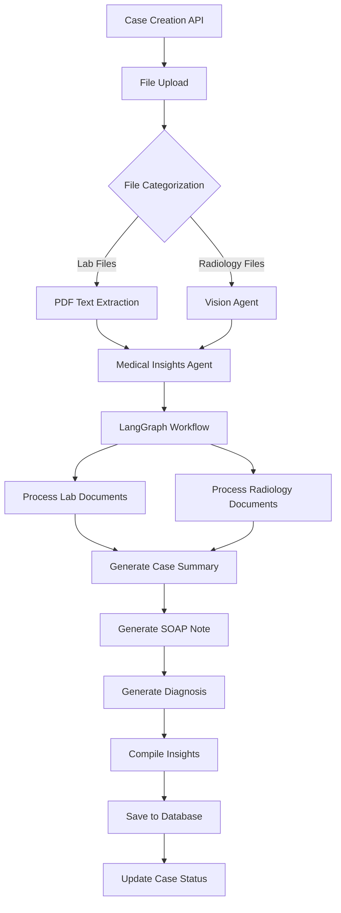
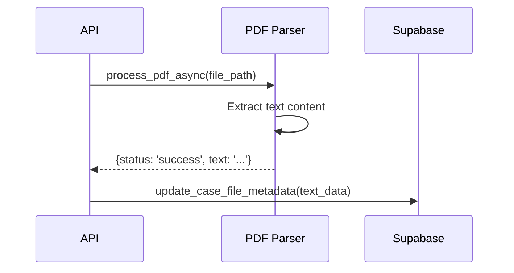
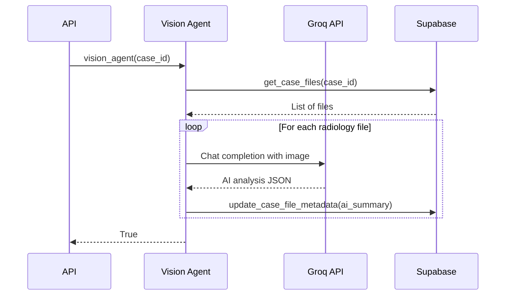
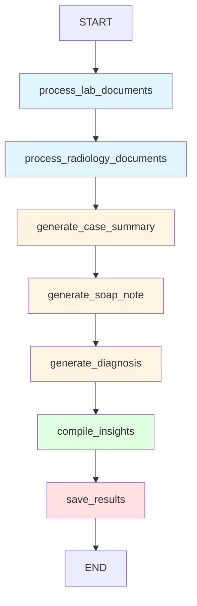
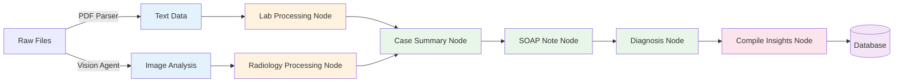

## Overview

This page documents the complete end-to-end workflow for processing medical cases in MedMitra, from initial file upload through AI analysis to final insights generation.

## High-Level Architecture



## Phase 1: Case Creation & File Upload

### Step 1: API Request

A case is created via the `/cases` endpoint:

```python
POST /api/v1/cases
{
  "user_id": "uuid",
  "patient_name": "John Doe",
  "patient_age": 45,
  "patient_gender": "Male",
  "case_summary": "Patient presents with chest pain",
  "lab_files": [...],
  "radiology_files": [...]
}
```

### Step 2: File Categorization

Files are categorized based on type:

```python backend/agentic.py:37-67
if lab_files:
    logger.info("Processing lab files...")
    for lab_file in lab_files:
        file_id = lab_file.get('file_id')
        file_content = lab_file.get('file_content')
        file_type = lab_file.get('file_type')
        
        # Extract text from PDF
        with tempfile.NamedTemporaryFile(delete=False, suffix='.pdf') as temp_file:
            temp_file.write(file_content)
            temp_file_path = temp_file.name
        
        result = await process_pdf_async(temp_file_path)
        
        if result.get('status') == 'success':
            await supabase.update_case_file_metadata(
                file_id=file_id, 
                metadata={"text_data": result.get('text', '')}
            )
```

**File Categories**:
- `lab`: Laboratory reports, blood work, chemical analyses
- `radiology`: X-rays, CT scans, MRI images, ultrasounds

## Phase 2: Document Processing

### Lab Document Processing



**Output**: Plain text extraction stored in `metadata.text_data`

### Radiology Document Processing



**Output**: Structured JSON analysis stored in `metadata.ai_summary`

## Phase 3: Medical Insights Generation

### Step 1: Case Input Preparation

After file processing, the orchestrator prepares input for the Medical Insights Agent:

```python backend/agentic.py:78-109
case_files = await supabase.get_case_files(case_id=case_id)

processed_lab_files = []
processed_radiology_files = []

for file_record in case_files:
    processed_file = ProcessedFile(
        file_id=file_record["file_id"],
        file_name=file_record["file_name"],
        file_type=file_record["file_type"],
        file_category=file_record["file_category"],
        text_data=file_record.get("text_data", None),
        ai_summary=file_record.get("ai_summary", None)
    )
    
    if file_record["file_category"] == "lab":
        processed_lab_files.append(processed_file)
    elif file_record["file_category"] == "radiology":
        processed_radiology_files.append(processed_file)

case_input = CaseInput(
    case_id=case_id,
    patient_data=PatientData(
        name=patient_name,
        age=patient_age,
        gender=patient_gender
    ),
    doctor_case_summary=case_summary,
    lab_files=processed_lab_files,
    radiology_files=processed_radiology_files
)
```

### Step 2: LangGraph Workflow Execution

The Medical Insights Agent processes the case through a LangGraph state machine:

```python backend/agents/medical_ai_agent.py:314-333
async def process(self, case_input: CaseInput) -> MedicalInsights:
    initial_state = MedicalAnalysisState(
        case_input=case_input,
        processed_lab_docs=[],
        processed_radiology_docs=[],
        case_summary=None,
        soap_note=None,
        primary_diagnosis=None,
        medical_insights=None,
        processing_errors=[],
        processing_stage="initialized",
        confidence_scores={}
    )
    
    final_state = await self.workflow.ainvoke(initial_state)
    return final_state["medical_insights"]
```

## LangGraph Workflow Detailed

### Complete Graph Structure



### Node Execution Order

<Steps>
  <Step title="Initialize State">
    Create `MedicalAnalysisState` with case input and empty analysis fields
  </Step>
  
  <Step title="Process Lab Documents" icon="flask">
    - Extract lab values from text using LLM
    - Generate summaries of findings
    - Store structured `LabDocument` objects
    
    **State Update**: `processed_lab_docs`, `processing_stage = "lab_documents_processed"`
  </Step>
  
  <Step title="Process Radiology Documents" icon="x-ray">
    - Parse Vision Agent JSON output
    - Extract summary text
    - Create `RadiologyDocument` objects
    
    **State Update**: `processed_radiology_docs`, `processing_stage = "radiology_documents_processed"`
  </Step>
  
  <Step title="Generate Case Summary" icon="file-lines">
    - Synthesize patient info, doctor notes, lab results, and radiology findings
    - Identify key findings
    - Calculate confidence score
    
    **State Update**: `case_summary`, `processing_stage = "case_summary_generated"`
  </Step>
  
  <Step title="Generate SOAP Note" icon="clipboard-list">
    - Create structured clinical note
    - Separate Subjective, Objective, Assessment, Plan
    - Include confidence assessment
    
    **State Update**: `soap_note`, `processing_stage = "soap_note_generated"`
  </Step>
  
  <Step title="Generate Diagnosis" icon="stethoscope">
    - Determine primary diagnosis
    - Assign ICD-10 code
    - List supporting evidence
    
    **State Update**: `primary_diagnosis`, `processing_stage = "diagnosis_generated"`
  </Step>
  
  <Step title="Compile Insights" icon="box-open">
    - Aggregate all analysis results
    - Calculate overall confidence score
    - Package into `MedicalInsights` object
    
    **State Update**: `medical_insights`, `processing_stage = "insights_compiled"`
  </Step>
  
  <Step title="Save Results" icon="database">
    - Serialize insights to JSON
    - Upload to Supabase
    - Update processing stage
    
    **State Update**: `processing_stage = "completed"`
  </Step>
</Steps>

## State Transitions

The `MedicalAnalysisState` evolves through the workflow:

```python
# Initial State
{
  "case_input": CaseInput(...),
  "processed_lab_docs": [],
  "processed_radiology_docs": [],
  "case_summary": None,
  "soap_note": None,
  "primary_diagnosis": None,
  "medical_insights": None,
  "processing_errors": [],
  "processing_stage": "initialized",
  "confidence_scores": {}
}

# After process_lab_documents
{
  "processed_lab_docs": [LabDocument(...), ...],
  "processing_stage": "lab_documents_processed",
  ...
}

# After generate_case_summary
{
  "case_summary": CaseSummary(
    comprehensive_summary="...",
    key_findings=[...],
    confidence_score=0.85
  ),
  "processing_stage": "case_summary_generated",
  ...
}

# Final State
{
  "medical_insights": MedicalInsights(
    case_summary=...,
    soap_note=...,
    primary_diagnosis=...,
    overall_confidence_score=0.83
  ),
  "processing_stage": "completed",
  ...
}
```

## Data Flow Visualization



## Confidence Score Calculation

Confidence scores flow through the workflow and are aggregated at the end:

```python
# Individual node confidence scores
case_summary.confidence_score = 0.85  # Based on data completeness
soap_note.confidence_score = 0.82     # Based on clinical consistency
primary_diagnosis.confidence_score = 0.81  # Based on evidence strength

# Overall confidence (arithmetic mean)
overall_confidence = (0.85 + 0.82 + 0.81) / 3 = 0.827
```

### Confidence Score Factors

<AccordionGroup>
  <Accordion title="Data Completeness" icon="database">
    - Percentage of expected fields populated
    - Availability of supporting documents
    - Quality of OCR/extraction results
  </Accordion>
  
  <Accordion title="Model Certainty" icon="brain">
    - LLM's internal confidence signals
    - Consistency of outputs across prompts
    - Presence of qualifying language
  </Accordion>
  
  <Accordion title="Clinical Consistency" icon="check">
    - Agreement between different data sources
    - Logical coherence of findings
    - Standard diagnostic criteria met
  </Accordion>
</AccordionGroup>

## Error Handling Strategy

### Node-Level Error Handling

Each node handles errors gracefully:

```python backend/agents/medical_ai_agent.py:288-310
async def _save_results(self, state: MedicalAnalysisState) -> MedicalAnalysisState:
    try:
        insights_data = state["medical_insights"].model_dump()
        await self.supabase.upload_ai_insights(
            case_id=state["case_input"].case_id,
            insights=insights_data
        )
        state["processing_stage"] = "completed"
        
    except Exception as e:
        logger.error(f"Error saving results: {e}")
        state["processing_errors"].append(f"Error saving results: {str(e)}")
        state["processing_stage"] = "error"
    
    return state
```

### Workflow-Level Error Handling

```python backend/agentic.py:118-121
try:
    medical_insights = await medical_agent.process(case_input)
    await supabase.update_case_status(case_id=case_id, status="completed")
except Exception as e:
    logger.error(f"Error in AI insights generation: {e}")
    await supabase.update_case_status(case_id=case_id, status="failed")
    raise e
```

## Performance Metrics

### Typical Processing Times

| Stage | Duration | Notes |
|-------|----------|-------|
| File Upload | 1-3s | Per file, depends on size |
| PDF Extraction | 2-5s | Per document |
| Vision Analysis | 3-6s | Per image |
| Lab Processing | 5-10s | Per document |
| Case Summary | 8-12s | Single LLM call |
| SOAP Note | 6-10s | Single LLM call |
| Diagnosis | 7-11s | Single LLM call |
| **Total End-to-End** | **30-60s** | For typical case |

### Optimization Opportunities

<CardGroup cols={2}>
  <Card title="Parallel Vision Processing" icon="bolt">
    Process multiple radiology images concurrently using `asyncio.gather`
  </Card>
  <Card title="Batch LLM Calls" icon="layer-group">
    Combine multiple prompts into single API calls where possible
  </Card>
  <Card title="Caching" icon="memory">
    Cache common lab value extractions and medical terminology
  </Card>
  <Card title="Streaming" icon="water">
    Stream partial results to UI as they become available
  </Card>
</CardGroup>

## Database Schema

### Cases Table

```sql
CREATE TABLE cases (
  case_id UUID PRIMARY KEY,
  user_id UUID REFERENCES users(id),
  patient_name TEXT,
  patient_age INTEGER,
  patient_gender TEXT,
  case_summary TEXT,
  status TEXT,  -- 'processing', 'completed', 'failed'
  created_at TIMESTAMP,
  updated_at TIMESTAMP
);
```

### Case Files Table

```sql
CREATE TABLE case_files (
  file_id UUID PRIMARY KEY,
  case_id UUID REFERENCES cases(case_id),
  file_name TEXT,
  file_type TEXT,
  file_category TEXT,  -- 'lab' or 'radiology'
  file_url TEXT,
  metadata JSONB,  -- Contains text_data or ai_summary
  uploaded_at TIMESTAMP
);
```

### AI Insights Table

```sql
CREATE TABLE ai_insights (
  insight_id UUID PRIMARY KEY,
  case_id UUID REFERENCES cases(case_id),
  insights JSONB,  -- Full MedicalInsights JSON
  generated_at TIMESTAMP
);
```

## Complete Example

Here's a complete trace of processing a real case:

```python
# 1. API Call
POST /api/v1/cases
{
  "patient_name": "Jane Doe",
  "patient_age": 62,
  "patient_gender": "Female",
  "case_summary": "Chronic cough, 3 weeks duration",
  "lab_files": [blood_test.pdf],
  "radiology_files": [chest_xray.jpg]
}

# 2. File Processing
# - blood_test.pdf -> Text extraction
# - chest_xray.jpg -> Vision analysis

# 3. Medical Insights Workflow
initial_state = {
  "case_input": CaseInput(...),
  "processing_stage": "initialized"
}

# Node 1: process_lab_documents
state["processed_lab_docs"] = [
  LabDocument(
    file_name="blood_test.pdf",
    lab_values={"WBC": "12.5", "CRP": "45"},
    summary="Elevated WBC and CRP suggesting infection"
  )
]

# Node 2: process_radiology_documents
state["processed_radiology_docs"] = [
  RadiologyDocument(
    file_name="chest_xray.jpg",
    summary="Right lower lobe consolidation consistent with pneumonia"
  )
]

# Node 3: generate_case_summary
state["case_summary"] = CaseSummary(
  comprehensive_summary="62-year-old female with 3-week history of cough...",
  key_findings=["Elevated inflammatory markers", "RLL consolidation"],
  confidence_score=0.87
)

# Node 4: generate_soap_note
state["soap_note"] = SOAPNote(
  subjective="Patient reports persistent cough x3 weeks",
  objective="Labs: WBC 12.5, CRP 45. CXR: RLL consolidation",
  assessment="Community-acquired pneumonia",
  plan="Antibiotics, follow-up CXR in 6 weeks",
  confidence_score=0.84
)

# Node 5: generate_diagnosis
state["primary_diagnosis"] = Diagnosis(
  primary_diagnosis="Community-Acquired Pneumonia",
  icd_code="J18.9",
  description="Bacterial pneumonia affecting right lower lobe",
  confidence_score=0.88,
  supporting_evidence=[
    "Radiographic consolidation",
    "Elevated inflammatory markers",
    "Clinical presentation"
  ]
)

# Node 6: compile_insights
state["medical_insights"] = MedicalInsights(
  case_summary=...,
  soap_note=...,
  primary_diagnosis=...,
  overall_confidence_score=0.863
)

# Node 7: save_results
# -> Database upload
# -> Case status = "completed"
```

## API Response

The final insights are returned via the case retrieval endpoint:

```json
GET /api/v1/cases/{case_id}/insights

{
  "case_id": "uuid",
  "medical_insights": {
    "case_summary": {
      "comprehensive_summary": "...",
      "key_findings": [...],
      "confidence_score": 0.87
    },
    "soap_note": {
      "subjective": "...",
      "objective": "...",
      "assessment": "...",
      "plan": "...",
      "confidence_score": 0.84
    },
    "primary_diagnosis": {
      "primary_diagnosis": "Community-Acquired Pneumonia",
      "icd_code": "J18.9",
      "description": "...",
      "confidence_score": 0.88,
      "supporting_evidence": [...]
    },
    "overall_confidence_score": 0.863,
    "generated_at": "2026-03-04T19:30:00Z"
  }
}
```

## Next Steps

<CardGroup cols={3}>
  <Card title="Medical Insights Agent" icon="stethoscope" href="/ai-agents/medical-insights-agent">
    Detailed agent implementation
  </Card>
  <Card title="Vision Agent" icon="eye" href="/ai-agents/vision-agent">
    Image processing details
  </Card>
  <Card title="API Reference" icon="code" href="/api-reference/endpoints/create-case">
    Integration endpoints
  </Card>
</CardGroup>