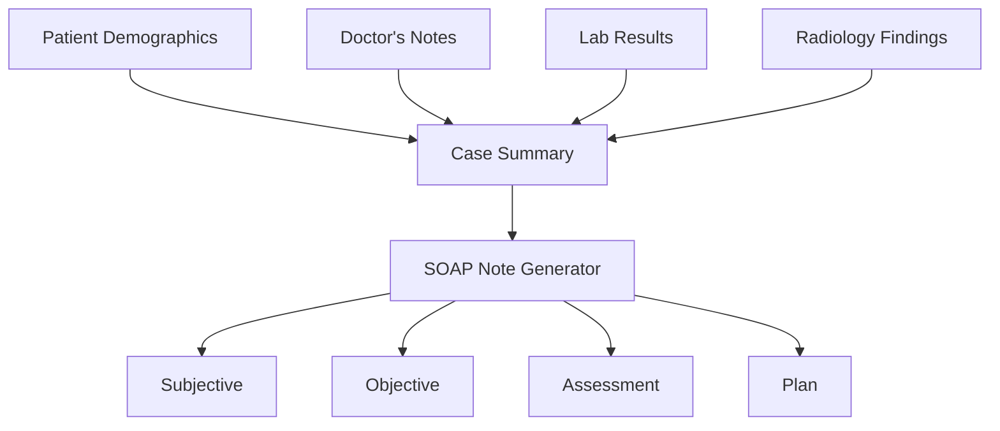

## Overview

MedMitra automatically generates SOAP (Subjective, Objective, Assessment, Plan) notes from case data. These standardized clinical notes organize patient information in a format widely used in healthcare documentation.

## What is a SOAP Note?

SOAP is a structured method for documenting patient encounters:

<CardGroup cols={2}>
  <Card title="Subjective" icon="comments">
    Patient's description of symptoms, history, and concerns
  </Card>
  <Card title="Objective" icon="microscope">
    Measurable clinical findings, lab results, and imaging
  </Card>
  <Card title="Assessment" icon="stethoscope">
    Clinical interpretation and diagnosis
  </Card>
  <Card title="Plan" icon="list-check">
    Treatment recommendations and follow-up
  </Card>
</CardGroup>

## Data Model

SOAP notes are structured using Pydantic models:

```python
class SOAPNote(BaseModel):
    subjective: str
    objective: str
    assessment: str
    plan: str
    confidence_score: float = Field(ge=0.0, le=1.0)
```

Source: `backend/models/data_models.py:63-68`

## Generation Process

SOAP notes are generated from the case summary:

<Steps>
  <Step title="Case Summary Input">
    Comprehensive case summary is provided as context
  </Step>
  <Step title="LLM Processing">
    Specialized prompt guides the LLM to extract SOAP components
  </Step>
  <Step title="Structure Validation">
    Output is validated against the SOAPNote model
  </Step>
  <Step title="Confidence Scoring">
    System assigns confidence score based on data completeness
  </Step>
</Steps>

### Implementation

```python
async def _generate_soap_note(self, state: MedicalAnalysisState) -> MedicalAnalysisState:
    """Generate SOAP note from case summary"""
    
    # Generate SOAP note using specialized prompt
    soap_response = await self.llm_manager.generate_response(
        system_prompt=SOAP_NOTE_PROMPT,
        user_input="Case Summary" + state["case_summary"].model_dump_json()
    )
    
    # Create structured SOAP note
    soap_note = SOAPNote(
        subjective=soap_response.get("subjective", ""),
        objective=soap_response.get("objective", ""),
        assessment=soap_response.get("assessment", ""),
        plan=soap_response.get("plan", ""),
        confidence_score=soap_response.get("confidence_score", 0.8)
    )
    
    state["soap_note"] = soap_note
    state["processing_stage"] = "soap_note_generated"
    return state
```

Source: `backend/agents/medical_ai_agent.py:164-184`

## SOAP Note Components

### Subjective Section

The subjective section captures:

- **Chief Complaint**: Primary reason for visit
- **History of Present Illness**: Timeline and progression of symptoms
- **Patient-Reported Symptoms**: Description in patient's own words
- **Relevant Medical History**: Past conditions, surgeries, medications
- **Social History**: Lifestyle factors affecting health

<Tip>
The subjective section is primarily derived from the doctor's initial case summary and patient demographics.
</Tip>

### Objective Section

The objective section includes:

- **Vital Signs**: If available in documentation
- **Physical Examination Findings**: From clinical notes
- **Laboratory Results**: Processed from uploaded lab files
  - Blood counts, chemistry panels
  - Urinalysis results
  - Microbiology cultures
- **Radiology Findings**: From vision AI analysis
  - X-ray interpretations
  - CT/MRI findings
  - Ultrasound results

<Note>
Objective data is extracted from processed lab documents and radiology reports analyzed by the vision AI.
</Note>

### Assessment Section

The assessment synthesizes findings:

- **Clinical Interpretation**: What the data means clinically
- **Working Diagnosis**: Most likely diagnosis based on evidence
- **Differential Considerations**: Other possible diagnoses
- **Severity Assessment**: Acute vs chronic, mild vs severe
- **Prognosis**: Expected outcome and course

### Plan Section

The plan outlines next steps:

- **Diagnostic Tests**: Additional investigations needed
- **Treatment Recommendations**: Medications, procedures, therapies
- **Patient Education**: Instructions and precautions
- **Follow-up**: When to return, monitoring requirements
- **Referrals**: Specialist consultations if needed

## Example SOAP Note

Here's what a generated SOAP note might look like:

<CodeGroup>
```json Generated SOAP Note
{
  "subjective": "31-year-old female patient Jane Daniel presents with respiratory symptoms. Patient reports progressive shortness of breath and persistent cough over the past week. No fever reported initially. Patient works in healthcare setting with potential exposure to infectious agents.",
  
  "objective": "Laboratory findings show elevated WBC count at 12,500/μL (normal 4,000-11,000), indicating possible infection. CRP elevated at 45 mg/L (normal <10). Chest X-ray reveals bilateral interstitial infiltrates consistent with pneumonia. No pleural effusion noted. Oxygen saturation 94% on room air.",
  
  "assessment": "Acute community-acquired pneumonia, likely atypical pattern based on radiographic findings. Moderate severity based on vital signs and lab values. Patient is ambulatory and hemodynamically stable. Differential includes viral pneumonia, mycoplasma pneumonia, or early bacterial pneumonia.",
  
  "plan": "1. Initiate empiric antibiotic therapy with azithromycin 500mg daily for 5 days. 2. Supportive care with adequate hydration and rest. 3. Monitor oxygen saturation at home; return if drops below 92%. 4. Follow-up chest X-ray in 6 weeks to confirm resolution. 5. Return to clinic in 3 days or sooner if symptoms worsen. 6. Work restrictions until afebrile for 24 hours.",
  
  "confidence_score": 0.85
}
```
</CodeGroup>

## Input Data Flow

SOAP notes are generated from multiple data sources:



### Data Integration

The SOAP generator receives:

```python
case_context = {
    "patient_info": "Name: Jane Daniel, Age: 31, Gender: Female",
    "doctor_notes": "Patient presents with respiratory symptoms",
    "lab_summaries": "Elevated WBC 12,500; CRP 45 mg/L",
    "radiology_summaries": "Bilateral interstitial infiltrates on CXR"
}
```

This comprehensive context ensures all clinical information is incorporated.

## Confidence Scoring

The confidence score (0.0-1.0) reflects:

<AccordionGroup>
  <Accordion title="Data Completeness">
    - All sections populated: Higher score
    - Missing objective data: Lower score
    - Comprehensive lab/radiology: Higher score
  </Accordion>
  
  <Accordion title="Clinical Clarity">
    - Clear presenting complaint: Higher score
    - Specific objective findings: Higher score
    - Definitive assessment: Higher score
  </Accordion>
  
  <Accordion title="Documentation Quality">
    - Detailed doctor's notes: Higher score
    - Multiple data sources: Higher score
    - Sparse information: Lower score
  </Accordion>
</AccordionGroup>

### Confidence Interpretation

- **0.9 - 1.0**: Excellent documentation, all sections well-supported
- **0.8 - 0.9**: Good documentation, minor gaps in data
- **0.7 - 0.8**: Adequate documentation, some assumptions made
- **Below 0.7**: Limited data, requires manual review and enhancement

## Accessing SOAP Notes

Retrieve SOAP notes through the case API:

```python
GET /cases/cases/{case_id}

Response:
{
  "case": {...},
  "files": [...],
  "ai_insights": {
    "soap_note": {
      "subjective": "...",
      "objective": "...",
      "assessment": "...",
      "plan": "...",
      "confidence_score": 0.85
    },
    "case_summary": {...},
    "primary_diagnosis": {...}
  }
}
```

## Clinical Workflow Integration

<Steps>
  <Step title="Case Creation">
    Doctor creates case with initial assessment
  </Step>
  <Step title="Document Upload">
    Lab reports and images are attached
  </Step>
  <Step title="Automatic Generation">
    SOAP note generated in background
  </Step>
  <Step title="Review and Edit">
    Doctor reviews AI-generated note
  </Step>
  <Step title="Documentation">
    Finalized note added to patient record
  </Step>
</Steps>

## Best Practices

<Tip>
**For Optimal SOAP Notes:**
- Provide detailed initial case summary
- Upload all relevant lab and imaging results
- Include complete patient demographics
- Review and validate AI-generated content
</Tip>

<Warning>
**Important Reminders:**
- AI-generated notes require physician review
- Not a substitute for clinical judgment
- Should be verified before use in patient care
- May require editing for specific clinical contexts
</Warning>

## Customization Potential

The SOAP note generation can be customized through:

1. **Prompt Engineering**: Modify `SOAP_NOTE_PROMPT` for specialty-specific formats
2. **Template Variations**: Different templates for different specialties
3. **Data Emphasis**: Weight certain findings more heavily
4. **Length Control**: Adjust verbosity of each section

## Use Cases

<CardGroup cols={2}>
  <Card title="Primary Care" icon="user-doctor">
    Routine office visit documentation
  </Card>
  <Card title="Emergency Medicine" icon="truck-medical">
    Rapid assessment documentation
  </Card>
  <Card title="Specialists" icon="stethoscope">
    Consultation notes and follow-ups
  </Card>
  <Card title="Telemedicine" icon="video">
    Remote visit documentation
  </Card>
</CardGroup>

## Limitations

<Warning>
Current limitations to be aware of:

- Relies on quality of input data
- May miss nuanced clinical context
- Cannot incorporate physical exam findings not documented
- Requires physician oversight and validation
- Not suitable for medico-legal documentation without review
</Warning>

## Next Steps

<CardGroup cols={2}>
  <Card title="Diagnosis Support" icon="stethoscope" href="/features/diagnosis-support">
    Learn about diagnostic recommendations
  </Card>
  <Card title="AI Analysis" icon="microchip" href="/features/ai-analysis">
    Understand the complete analysis workflow
  </Card>
</CardGroup>