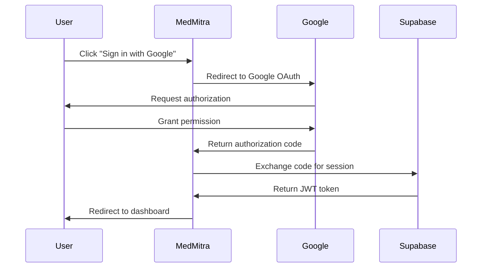

MedMitra uses secure authentication powered by Supabase Auth to protect your medical data and ensure only authorized users can access the system.

## Sign Up for a New Account

MedMitra offers a streamlined authentication process using Google OAuth for secure and convenient access.

<Steps>
  <Step title="Navigate to MedMitra">
    Open your web browser and go to the MedMitra application URL (e.g., `https://medmitra.vercel.app` or `http://localhost:3000` for local development).
  </Step>

  <Step title="Click Sign Up">
    If you're a new user, you'll be directed to the authentication page. Click on the **Sign Up** or **Get Started** button.
  </Step>

  <Step title="Choose Google Authentication">
    MedMitra uses Google OAuth for secure authentication. Click the **Sign in with Google** button.
    
    <Note>
      Google OAuth provides enterprise-grade security and eliminates the need to remember another password.
    </Note>
  </Step>

  <Step title="Authorize with Google">
    You'll be redirected to Google's authentication page. Select the Google account you want to use for MedMitra and grant the necessary permissions.
    
    The application will request:
    - Your basic profile information (name, email)
    - Email address for account identification
  </Step>

  <Step title="Complete Registration">
    After authorizing, you'll be automatically redirected back to MedMitra. Your account will be created, and you'll be logged in immediately.
  </Step>
</Steps>

## Logging In

Returning users can quickly access their account using the same Google authentication flow.

<Steps>
  <Step title="Go to the Login Page">
    Navigate to the MedMitra application URL. If you're not already logged in, you'll see the login page.
  </Step>

  <Step title="Sign In with Google">
    Click the **Sign in with Google** button and select your Google account.
    
    <Tip>
      If you're already logged into Google in your browser, the sign-in process will be even faster!
    </Tip>
  </Step>

  <Step title="Access Your Dashboard">
    After successful authentication, you'll be redirected to your dashboard where you can view and manage all your patient cases.
  </Step>
</Steps>

## Session Management

MedMitra maintains secure session management to keep you logged in while protecting your data.

### Active Sessions

- Your session remains active as long as you're using the application
- Sessions automatically refresh to keep you logged in during active use
- Inactive sessions expire after a period of inactivity for security

### Signing Out

To log out of your MedMitra account:

<Steps>
  <Step title="Access User Menu">
    Click on your profile icon or username in the top-right corner of the navigation bar.
  </Step>

  <Step title="Click Sign Out">
    Select **Sign Out** from the dropdown menu.
  </Step>

  <Step title="Confirm Logout">
    You'll be logged out immediately and redirected to the home page. All your data remains secure and will be available when you log back in.
  </Step>
</Steps>

## Security Features

MedMitra implements multiple security layers to protect your medical data:

<CardGroup cols={2}>
  <Card title="OAuth 2.0" icon="lock">
    Industry-standard OAuth 2.0 protocol ensures secure authentication without exposing passwords.
  </Card>
  
  <Card title="Encrypted Connections" icon="shield-halved">
    All data transmitted between your browser and MedMitra servers is encrypted using HTTPS/TLS.
  </Card>
  
  <Card title="Session Tokens" icon="key">
    Secure JWT tokens manage your session with automatic expiration and refresh mechanisms.
  </Card>
  
  <Card title="User Isolation" icon="user-shield">
    Each user's data is completely isolated. You can only access cases you've created.
  </Card>
</CardGroup>

## Authentication Flow

Understanding the authentication process can help troubleshoot any issues:



## Technical Details

### Authentication Implementation

MedMitra's authentication is implemented using:

- **Frontend**: `@supabase/supabase-js` and `@supabase/ssr` for client-side authentication
- **Backend**: Supabase Service Role Key for server-side operations
- **Middleware**: Next.js middleware validates sessions on protected routes

### Code Reference

The authentication logic is implemented in:

- Client-side auth: `frontend/utils/supabase/client.ts`
- Server-side auth: `frontend/utils/supabase/server.ts`
- Auth actions: `frontend/app/actions.ts:15-28`
- Middleware protection: `frontend/middleware.ts`

<CodeGroup>

```typescript frontend/app/actions.ts
export const signInWithGoogleAction = async () => {
  const supabase = await createClient();
  const origin = (await headers()).get("origin");

  const { data, error } = await supabase.auth.signInWithOAuth({
    provider: 'google',
    options: {
      redirectTo: `${origin}/auth/callback`,
    },
  })

  if (data.url) {
    redirect(data.url)
  }
}
```

</CodeGroup>

## Troubleshooting

<AccordionGroup>
  <Accordion title="I can't log in with Google">
    **Possible causes:**
    - Pop-up blockers preventing the OAuth window from opening
    - Third-party cookies disabled in your browser
    - Ad blockers interfering with Google authentication
    
    **Solutions:**
    - Allow pop-ups for the MedMitra domain
    - Enable third-party cookies for authentication
    - Temporarily disable ad blockers during login
    - Try using an incognito/private browsing window
  </Accordion>

  <Accordion title="I'm logged out unexpectedly">
    **Possible causes:**
    - Session token expired due to inactivity
    - Browser cleared cookies/local storage
    - Multiple tabs with conflicting sessions
    
    **Solutions:**
    - Simply log back in using Google authentication
    - Check if your browser is set to clear cookies on exit
    - Avoid using multiple accounts in the same browser session
  </Accordion>

  <Accordion title="Authentication callback error">
    **Possible causes:**
    - Invalid redirect URL configuration
    - Network connectivity issues
    - Expired authorization code
    
    **Solutions:**
    - Refresh the page and try logging in again
    - Check your internet connection
    - Clear browser cache and cookies
    - Contact support if the issue persists
  </Accordion>
</AccordionGroup>

## Best Practices

<Tip>
  For the best experience with MedMitra authentication:
  
  - Use a stable Google account that you have regular access to
  - Keep your Google account secure with two-factor authentication
  - Log out when using shared or public computers
  - Don't share your session tokens or authentication credentials
  - Report any suspicious activity immediately
</Tip>

## Next Steps

Once you're authenticated, you can:

<CardGroup cols={2}>
  <Card title="Create Your First Case" icon="file-medical" href="/guides/creating-cases">
    Learn how to create and manage patient cases
  </Card>
  
  <Card title="Upload Documents" icon="cloud-arrow-up" href="/guides/uploading-documents">
    Start uploading medical documents for AI analysis
  </Card>
</CardGroup>
