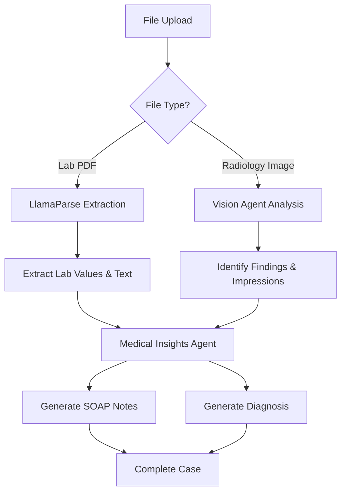

MedMitra's document upload system allows you to securely upload medical files that will be analyzed by AI agents to generate comprehensive clinical insights.

## Supported Document Types

MedMitra supports two main categories of medical documents:

<CardGroup cols={2}>
  <Card title="Lab Reports" icon="flask">
    Blood tests, urinalysis, metabolic panels, and other laboratory results
    
    **Formats:** PDF, CSV  
    **Max Size:** 10 MB per file
  </Card>
  
  <Card title="Radiology Images" icon="x-ray">
    X-rays, CT scans, MRI images, and other medical imaging
    
    **Formats:** JPEG, PNG, DICOM (.dcm)  
    **Max Size:** 50 MB per file
  </Card>
</CardGroup>

## Uploading During Case Creation

The most common way to upload documents is during case creation.

<Steps>
  <Step title="Navigate to New Case">
    Click **New Case** from the dashboard or cases page.
  </Step>

  <Step title="Locate Upload Sections">
    On the right side of the form, you'll find two upload sections:
    - **Lab Reports** (top)
    - **Radiology Images** (bottom)
  </Step>

  <Step title="Choose Upload Method">
    You have two options for uploading files:
    
    ### Drag and Drop
    
    Simply drag files from your computer and drop them into the upload area. The area will highlight when you drag files over it.
    
    <Tip>
      Drag and drop is the fastest way to upload multiple files at once!
    </Tip>
    
    ### Click to Browse
    
    Click anywhere in the upload area to open your file browser, then select one or multiple files.
  </Step>

  <Step title="Verify File Upload">
    After selecting or dropping files:
    
    - Files appear in a list below the upload area
    - Each file shows its name, size, and type icon
    - Invalid files are rejected with an error message
    
    <CodeGroup>
    ```typescript File Validation
    // Lab Reports: PDF or CSV only
const labAllowedTypes = ['text/csv', 'application/pdf'];

// Radiology: Images and DICOM only
const radiologyAllowedTypes = [
  'image/jpeg',
  'image/png',
  'application/dicom',
  'image/dicom'
];
    ```
    </CodeGroup>
  </Step>

  <Step title="Remove Files if Needed">
    To remove an uploaded file before submission:
    
    - Click the **X** button next to the file name
    - The file is removed from the upload queue
    - You can upload a different file in its place
  </Step>

  <Step title="Submit the Case">
    When you click **Create Case**, all uploaded files are:
    
    1. Uploaded to Supabase Storage
    2. Linked to the case record
    3. Queued for AI processing
  </Step>
</Steps>

## File Processing Pipeline

Understanding how files are processed helps you prepare better documents:



## Lab Report Processing

Lab reports undergo specialized text extraction and analysis.

### Supported Lab Report Formats

<Tabs>
  <Tab title="PDF Reports">
    **Best for:** Standard lab results from hospitals and clinics
    
    **Requirements:**
    - Text-based PDFs (not scanned images without OCR)
    - Clear, readable text
    - Standard formatting
    
    **Processing:**
    - Parsed using LlamaParse technology
    - Text and structure extracted
    - Lab values and units identified
    - Reference ranges detected
  </Tab>
  
  <Tab title="CSV Reports">
    **Best for:** Exported lab data from laboratory systems
    
    **Requirements:**
    - Valid CSV format
    - Column headers included
    - Consistent structure
    
    **Processing:**
    - Direct parsing of structured data
    - Automatic field mapping
    - Numerical value extraction
  </Tab>
</Tabs>

### What Gets Extracted

The AI extracts key information from lab reports:

- Test names and types
- Measured values and units
- Reference ranges (normal values)
- Abnormal findings and flags
- Test dates and timestamps
- Laboratory details

## Radiology Image Processing

Radiology images are analyzed by the Vision Agent using multimodal AI.

### Supported Image Formats

| Format | Extension | Description | Max Size |
|--------|-----------|-------------|----------|
| JPEG | `.jpg`, `.jpeg` | Compressed images, good for X-rays | 50 MB |
| PNG | `.png` | Lossless compression, high quality | 50 MB |
| DICOM | `.dcm`, `.dicom` | Medical imaging standard format | 50 MB |

### Vision Agent Analysis

For each radiology image, the Vision Agent:

<Steps>
  <Step title="Image Preprocessing">
    The image is prepared for analysis:
    - Format validation
    - Quality assessment
    - Optimal size calculation
  </Step>

  <Step title="AI Model Analysis">
    The image is sent to the LLaVA multimodal model via Groq API:
    - Visual features extracted
    - Medical patterns identified
    - Anatomical structures recognized
  </Step>

  <Step title="Structured Output Generation">
    The AI returns a structured JSON response:
    
    ```json
    {
      "findings": "Detailed description of visible findings",
      "impressions": "Clinical impressions and conclusions",
      "confidence_score": 0.92,
      "anatomical_regions": ["chest", "lungs"],
      "abnormalities_detected": ["opacity in right lung"]
    }
    ```
  </Step>

  <Step title="Storage and Linking">
    The analysis is:
    - Saved to the database
    - Linked to the specific file
    - Used in comprehensive case analysis
  </Step>
</Steps>

<Warning>
  The Vision Agent's analysis is meant to **assist** clinical decision-making, not replace professional medical judgment. Always verify AI findings with your own clinical assessment.
</Warning>

## Upload Best Practices

<AccordionGroup>
  <Accordion title="Preparing Lab Reports">
    **Before uploading lab reports:**
    
    ✅ **Do:**
    - Use text-based PDFs when possible
    - Include complete reports with reference ranges
    - Upload recent tests first
    - Use descriptive filenames with dates
    
    ❌ **Don't:**
    - Upload scanned images without OCR
    - Submit partial or cut-off reports
    - Mix multiple patient reports in one file
    - Upload password-protected PDFs
  </Accordion>

  <Accordion title="Preparing Radiology Images">
    **Before uploading radiology images:**
    
    ✅ **Do:**
    - Use high-resolution images
    - Ensure proper lighting and contrast
    - Upload DICOM files when available (highest quality)
    - Include multiple views if relevant
    
    ❌ **Don't:**
    - Upload blurry or low-quality images
    - Submit heavily compressed images
    - Include non-medical images
    - Upload images with patient identifiers visible (if privacy-restricted)
  </Accordion>

  <Accordion title="Organizing Multiple Files">
    **Tips for managing multiple documents:**
    
    - Upload all files at once during case creation
    - Use consistent naming conventions
    - Group related files (e.g., all blood tests together)
    - Include dates in filenames: `chest-xray-2024-03-04.jpg`
    - Keep file sizes reasonable for faster upload
  </Accordion>
</AccordionGroup>

## File Storage and Security

Your uploaded documents are handled with enterprise-grade security:

<CardGroup cols={2}>
  <Card title="Encrypted Storage" icon="lock">
    All files are stored in Supabase Storage with encryption at rest
  </Card>
  
  <Card title="Access Control" icon="shield-check">
    Files are only accessible by the user who uploaded them
  </Card>
  
  <Card title="Secure Transfer" icon="shield-halved">
    Uploads use HTTPS/TLS encryption during transfer
  </Card>
  
  <Card title="Audit Trail" icon="clock-rotate-left">
    All file access is logged for security and compliance
  </Card>
</CardGroup>

## Technical Implementation

The upload process is handled by multiple components:

<CodeGroup>

```typescript File Upload Component
// frontend/components/forms/file-upload.tsx
const handleFileUpload = (files: FileList | null, category: string) => {
  if (!files) return;

  const allowedTypes = category === 'lab' 
    ? ['text/csv', 'application/pdf']
    : ['image/jpeg', 'image/png', 'application/dicom'];

  Array.from(files).forEach(file => {
    if (allowedTypes.includes(file.type)) {
      // Add to upload queue
      setUploadedFiles(prev => [...prev, newFile]);
    } else {
      alert(`Invalid file type for ${category}`);
    }
  });
};
```

```python Backend File Processing
# backend/routes/case.py:69-96
async def process_files(files, category):
    processed_files = []
    for file in files or []:
        file_content = await file.read()
        
        # Upload to Supabase Storage
        file_result = await supabase_client.upload_case_file(
            file_id=file_id,
            case_id=case_id,
            file_data=file_data,
            file_content=file_content
        )
        
        # Queue for AI processing
        processed_files.append({**file_data, "file_content": file_content})
    
    return processed_files
```

</CodeGroup>

## Troubleshooting Upload Issues

<AccordionGroup>
  <Accordion title="Upload fails or times out">
    **Possible causes:**
    - File size exceeds limit
    - Slow internet connection
    - Browser compatibility issues
    
    **Solutions:**
    - Compress large files before uploading
    - Try a faster internet connection
    - Use a modern browser (Chrome, Firefox, Safari, Edge)
    - Upload files in smaller batches
  </Accordion>

  <Accordion title="File type not accepted">
    **Possible causes:**
    - Incorrect file format
    - File extension doesn't match content
    - Corrupted file
    
    **Solutions:**
    - Verify file format matches supported types
    - Convert files to supported formats
    - Try re-exporting the file from the source application
    - Check file isn't corrupted by opening it locally
  </Accordion>

  <Accordion title="Uploaded file not appearing">
    **Possible causes:**
    - Upload still in progress
    - Browser cache issue
    - Upload failed silently
    
    **Solutions:**
    - Wait for upload to complete (check browser network tab)
    - Refresh the page
    - Clear browser cache
    - Try uploading again
  </Accordion>
</AccordionGroup>

## Upload Limits and Quotas

Current upload limits:

| Limit Type | Value |
|------------|-------|
| Lab Report File Size | 10 MB |
| Radiology Image File Size | 50 MB |
| Files per Case | Unlimited |
| Total Storage per User | Depends on plan |
| Concurrent Uploads | 5 at a time |

<Info>
  If you need higher limits for your use case, contact support to discuss enterprise options.
</Info>

## Next Steps

After uploading documents:

<CardGroup cols={2}>
  <Card title="View AI Insights" icon="sparkles" href="/guides/viewing-insights">
    Learn how to review the AI analysis of your documents
  </Card>
  
  <Card title="Understand SOAP Notes" icon="file-medical" href="/features/soap-notes">
    Deep dive into AI-generated SOAP notes
  </Card>
</CardGroup>
