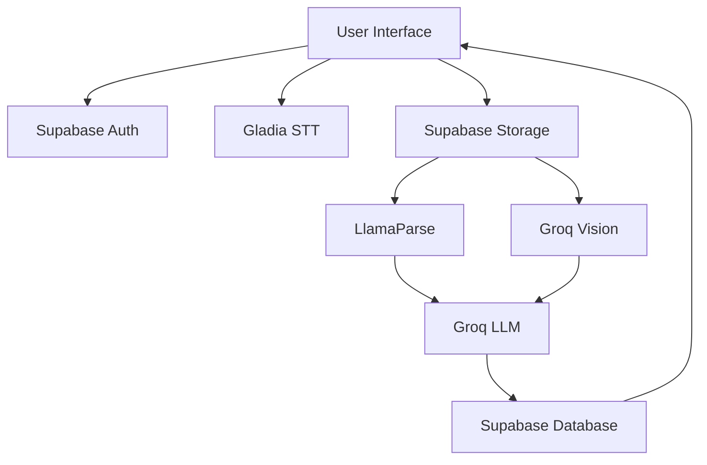

MedMitra integrates with several powerful external services to deliver its AI-powered medical case management capabilities. Each integration plays a crucial role in the system's functionality.

## Core Integrations

<CardGroup cols={2}>
  <Card title="Supabase" icon="database" href="/integrations/supabase">
    Backend-as-a-Service providing database, authentication, and file storage
  </Card>
  
  <Card title="Groq" icon="bolt" href="/integrations/groq">
    Ultra-fast LLM inference for medical insights and radiology analysis
  </Card>
  
  <Card title="LlamaParse" icon="file-pdf" href="/integrations/llamaparse">
    Intelligent PDF parsing for extracting structured data from lab reports
  </Card>
  
  <Card title="Gladia" icon="microphone" href="/integrations/gladia">
    Real-time speech-to-text for medical dictation and note-taking
  </Card>
</CardGroup>

## Integration Architecture

The integrations work together to create a seamless workflow:



## Setup Requirements

Before using MedMitra, you'll need to set up accounts and obtain API keys for:

1. **Supabase Project** - Database, auth, and storage
2. **Groq API Key** - LLM inference
3. **LlamaParse API Key** - Document parsing
4. **Gladia API Key** - Speech-to-text (optional)

<Info>
  All API keys should be stored in environment variables. See individual integration pages for specific setup instructions.
</Info>

## Environment Variables

MedMitra uses environment variables to securely manage API keys and configuration:

### Backend (.env)

```bash
# Supabase
SUPABASE_URL="https://your-project.supabase.co"
SUPABASE_SERVICE_ROLE_KEY="your-service-role-key"

# AI Services
GROQ_API_KEY="your-groq-api-key"
LLAMAPARSE_API_KEY="your-llamaparse-api-key"

# Optional: Vector Database
WEAVIATE_API_KEY="your-weaviate-api-key"
WEAVIATE_REST_URL="your-weaviate-url"
```

### Frontend (.env.local)

```bash
# Supabase (Client-side)
NEXT_PUBLIC_SUPABASE_URL="https://your-project.supabase.co"
NEXT_PUBLIC_SUPABASE_ANON_KEY="your-anon-key"

# Backend API
NEXT_PUBLIC_FASTAPI_BACKEND_URL="http://localhost:8000"

# Speech-to-Text
NEXT_PUBLIC_GLADIA_API_KEY="your-gladia-api-key"
```

<Warning>
  Never commit `.env` or `.env.local` files to version control. Use `.env.example` files to document required variables.
</Warning>

## Data Flow

### Case Creation & Document Processing

1. **User uploads documents** → Stored in Supabase Storage
2. **PDF lab reports** → Processed by LlamaParse
3. **Radiology images** → Analyzed by Groq Vision (LLaVA model)
4. **All data** → Stored in Supabase Database

### AI Insights Generation

1. **Aggregated data** → Sent to Groq LLM
2. **Medical analysis** → Case summary, SOAP notes, diagnosis
3. **Results** → Stored in Supabase Database
4. **Display** → Retrieved and shown in frontend

### Speech-to-Text Workflow

1. **User starts dictation** → Connects to Gladia WebSocket
2. **Audio streaming** → Real-time transcription
3. **Final transcript** → Added to case notes

## Cost Considerations

Each integration has different pricing models:

- **Supabase**: Free tier available, pay for storage/bandwidth
- **Groq**: Usage-based pricing (very competitive rates)
- **LlamaParse**: Credit-based system
- **Gladia**: Pay per audio processing minute

<Tip>
  Start with free tiers during development. Monitor usage in each service's dashboard before scaling to production.
</Tip>

## Next Steps

<CardGroup cols={2}>
  <Card title="Set up Supabase" icon="database" href="/integrations/supabase">
    Configure database, authentication, and file storage
  </Card>
  
  <Card title="Configure AI Services" icon="robot" href="/integrations/groq">
    Set up Groq and LlamaParse for AI processing
  </Card>
</CardGroup>